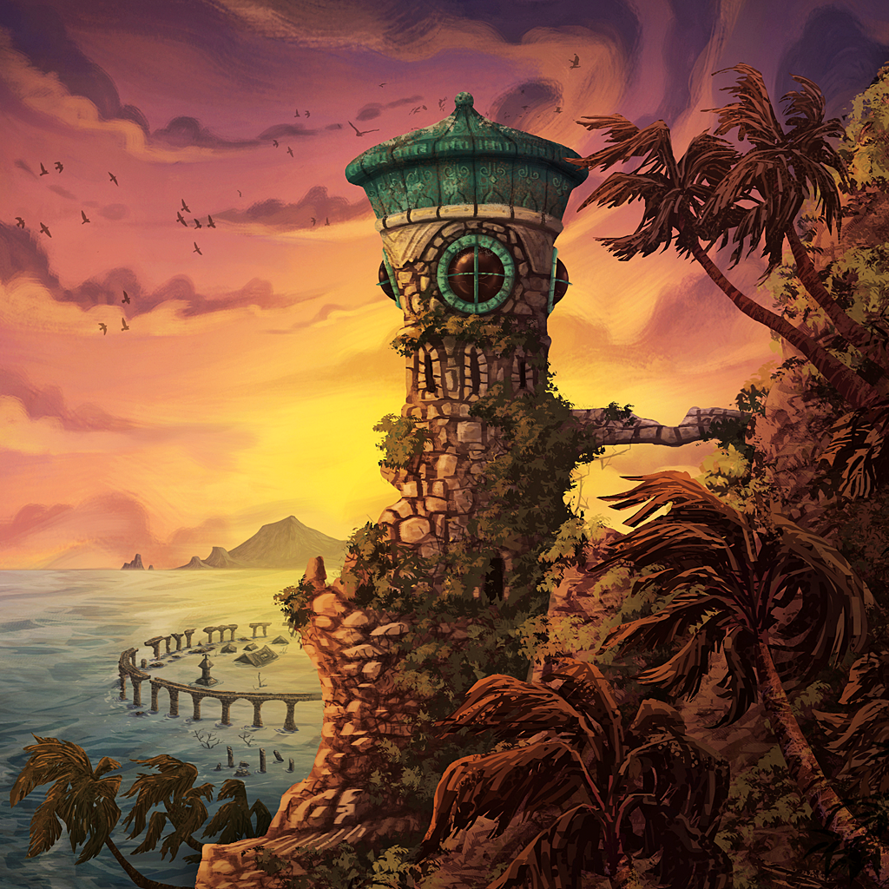

# Forbidden-Island

 

## **Description**

 

This project is a collaboration between Clément Gilli and [Louis-Alexis Peneloux](https://github.com/moleculeATP). Our goal is to develop the board game "The Forbidden Island" by Matt Leacock.

 

 

##   **Commands**
 

- `Z` - UP
- `Q` - RIGHT
- `S` - DOWN
- `D` - LEFT
- `F` - DRY MODE
- `R` - CATCH ARTIFACT
- `L` - USE SANDBAG
- `H` - USE HELICOPTER
- `V` - FLY MODE (PILOT ONLY)
- `A` - UP LEFT (EXPLORER ONLY)
- `E` - UP RIGHT (EXPLORER ONLY)
- `W` - DOWN LEFT (EXPLORER ONLY)
- `C` - DOWN RIGHT (EXPLORER ONLY)
