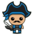
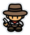
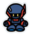
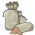
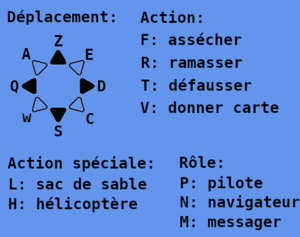
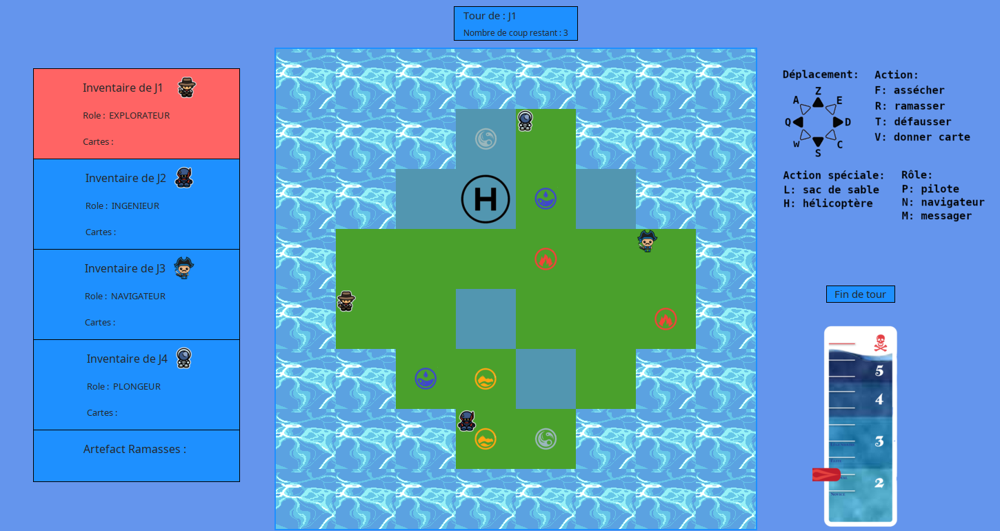

# Forbidden-Island

 

## **Description**

 

This project is a collaboration between Clément Gilli and [Louis-Alexis Peneloux](https://github.com/moleculeATP). Our goal is to develop the board game "The Forbidden Island" by Matt Leacock.

 

 

##   **Development**

 
We have implemented the whole game, including the extensions. So we managed to implement everything. However, we had a hard time implementing the key exchange and the "navigator" role which were complex, as well as the startup screen with the sliders, but we finally succeeded. Apart from that, the rest was pretty simple but quite long.
   
Clément was in charge of the board model, the display of the board and the players, the different roles and the special actions.
Louis-Alexis was in charge of the implementation of the card deck, the key exchange and the display of the players' inventories.
We did the biggest parts together, like the player model and controllers.

 

We have made an [uml](uml.pdf) diagram divided into 3 parts: model, view and controller.

##   **Rules**

 
The goal of the game is to collect the 4 different artifacts and then meet on the heliport.
You can lose in 4 different ways:

- the heliport has sunk
- a type of artifact has sunk
- a player has drowned
- the water level has reached the maximum level

 
To help you, there are 6 different roles with unique powers:
 
 

-  the diver can move in the water
-  the navigator can move another player one or two cases
-  the explorer can move and dry diagonally
-  the messenger can give cards to any player
-  the pilot can fly to any case
-  the engineer can dry a case at no cost

  In addition, you have 2 special cards:
 

-  the sandbag allows to dry any case
-  the helicopter allows you to fly with the other players on the case to any case

##   **Controls** 
 

##   **Interface** 

 

